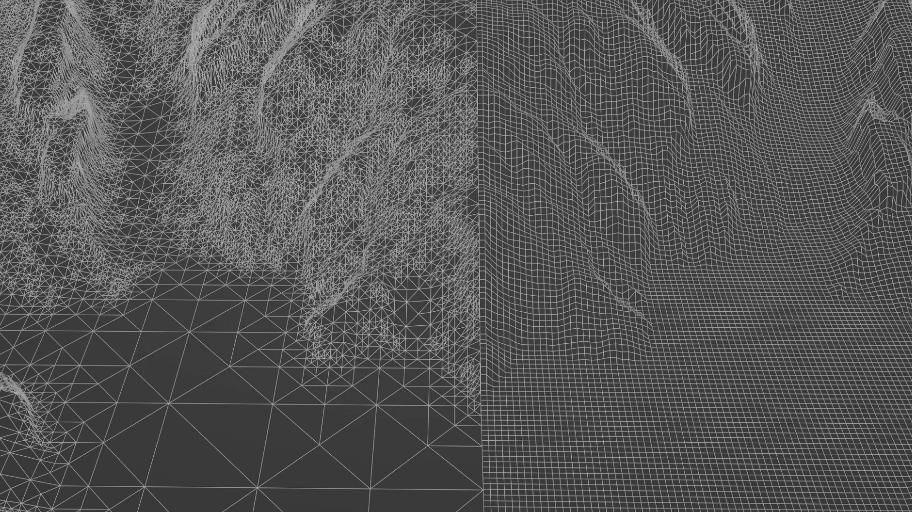

# Universal Instructions

Gaea terrains are consumed in other applications in two ways: as a mesh or as a displacement map. In this section, we will cover the general principles for importing terrains. For more details about specific software, see the [software-specific-instructions](software-specific-instructions/ "mention").

Game engines may also consume it as a Landscape / Terrain object. Each engine has strict, and often dramatically unique requirements so they're not included in these universal instructions. See the individual [software-specific-instructions](software-specific-instructions/ "mention")for those use cases as well.

## Mesh Output

Use the Mesher node to output the terrain as an OBJ or other support mesh.&#x20;

<figure><figcaption></figcaption></figure>

### Normalized Scale

As a best practice, export your mesh with Normalized scale. This means your terrain will be exported with a width of 1 unit, and height of proportional fraction of 1 unit.

<figure><figcaption></figcaption></figure>

Import the mesh into your target application such as Blender, 3dsmax, etc. then scale it by the same amount as the metric size of your terrain in Gaea's [Broken link](broken-reference "mention"). For example, if your terrain's width is 5000 meters then you should scale up your model by 5000.

Depending on your target application, your OBJ importer may allow you to scale up straight in the importer by specifying a factor.

### Real Scale

You can also export using Meters (1 unit = 1 meter) or Kilometers (1 unit = 1000 meters) and import without having to scale.

<figure><figcaption></figcaption></figure>

## Displacement Output

Use Mark for Export, or Output nodes to save your terrain as a displacement map. 32-bit precision (eg EXR, TIFF) are recommended for maximum quality. You can also use 16-bit precision if you terrain does use too many dramatic slope changes, otherwise you will see stairstepping/quantization patterns.

<figure><figcaption></figcaption></figure>

### Pure / Static Mesh

* Create a plane.
* Give it the same number of segments as the resolution of your terrain output. For example, if your terrain is 2048 x 2048, you should give it 2048 segments on both axes making it a dense grid-mesh where each vertex .
  * You can use half, or other factor, to reduce the number of polygons in your mesh. In the above example, you would use 1024 segments. Using power-of-2 factor (512, 1024, 2048, etc.) you can get a good, even match to the distance between displacement pixels and polygons.

### Subdivision Mesh

* Create a plane.
* Give it fewer segments (it is still recommended they be power-of-2, such as 64, 128, 256, etc.).
* Add a subdivision modifier or setting to the mesh.

### Adding the Displacement&#x20;

Depending on your target CG application, there can be two different ways to apply displacement: a Displace / Displacement modifier, or a Displacement slot or node in your shader/material.

Apply either and then assign it the heightmap from Gaea.&#x20;

The vertical amount for the displacement can differ based on the application.&#x20;

<figure><figcaption></figcaption></figure>

If you can accept it as a value in meters, and your plane has been set a size in meters equivalent to the Terrain Width in the Gaea [build-options](../build-and-export/build-options/ "mention"), then you can apply the same height as the Terrain Height.

If you have to enter a relative value, you can use the Height-Scale Ratio - either directly or to come up with an application specific value relative to your terrain.


Scale in terrains is an important concept. See [dimensions-and-scale.md](../../advanced-topics/technical-information/dimensions-and-scale.md "mention") to understand how scale works in Gaea and how it would convert to other applications.


