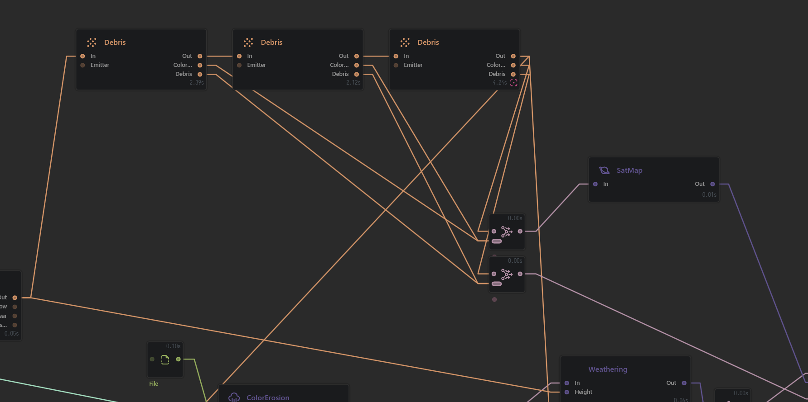
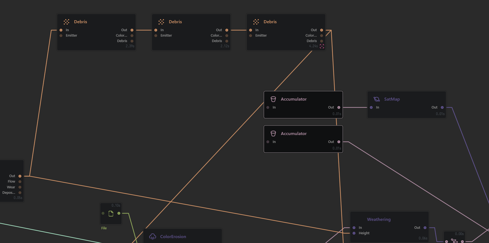

# Accumulators

## Reducing Clutter with Accumulators

One of the common ways a graph gets clutters with overlapping connections is when multiple Snow, Lake, or Debris nodes are used and their respective masks need to be combined for further use.

The new Accumulator node is a special type of standalone Generator node that can collect all such masks for you without creating several connections.

It works for Snow Mask, Snow Depth, Water Mask, Water Depth, Shore Mask, Debris Mask, Debris Color Index.

<figure><figcaption></figcaption></figure>

In this example, there are 3 Debris nodes that require 2 ports from each node to be connected to two different Combine nodes, creating a spread of several connections. The normal output from Debris also goes into two other nodes creating more visual clutter that needs to be deciphered before you can see which connection belongs where.

<figure><figcaption></figcaption></figure>

These connections, as well as the two Combine nodes, can be replaced by two Accumulator nodes. One set to Debris Mask, the other to Debris Color.

<figure><figcaption></figcaption></figure>


The Accumulator will only add nodes that have been built. To ensure all required nodes are built, connect the last node you will use for masking with the Accumulator output to the Accumulator Input. This will not affect the Accumulator but will ensure that all appropriate nodes are built.


