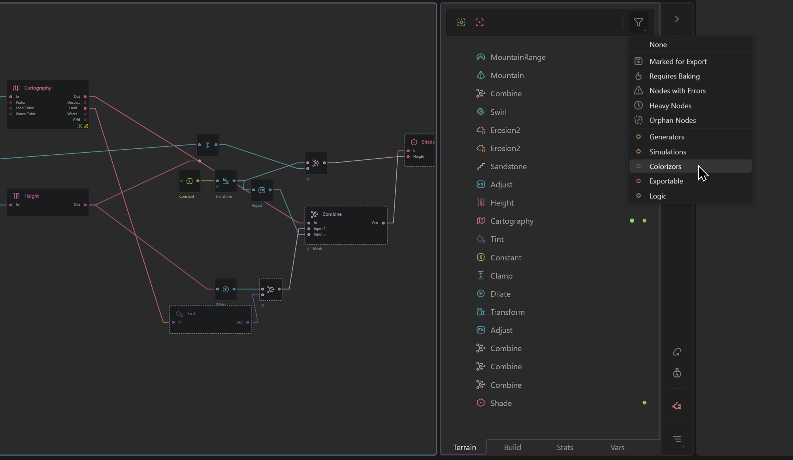

# Data View

The Data View is a set of tabs in the right side of the Graph, providing fast access to key information in your project.

<figure><figcaption></figcaption></figure>

## Terrain Tab

The Terrain tab consists of a Node Tree showing a simple hierarchy of Tabs > Groups > Nodes. Otherwise, nodes within these containers (Tabs or Groups) are shown the order they are laid out on the graph (left to right).

### Locked and Underlay Nodes

The green and pink icons at the top represent the current Locked Preview and Underlay nodes. You can hover over them to see which node it is and click the icon to navigate to that particular node.

### Filtering Nodes

The filter dropdown lets you isolate nodes by different types or behaviors. When filtered, other nodes are hidden from the tree and visually muted in the graph.

By Type: You can filter by type such as Generators, Simulations, Colorizors, etc. to see nodes of only that type in the tree.

**Marked for Export:** Shows nodes that will export data.

**Required Baking:** Shows all nodes that need to be baked before a Hybrid or Tiled build.

**Nodes with Error:** Shows nodes that may be faulting or failing validation. This is useful in tracking down terrains that won't build or fail during build.

**Heavy Nodes:** Shows nodes that take the most time to build in your graph, based on a median calculation.

**Orphan Nodes:** Shows nodes that are not connected or do not contribute to any final output. Removing orphans lets you save resources and reduce clutter.

## Build Tab

The Build Tab shows you nodes that are marked for export. Here you can refine the export settings such as the filename, which ports to export, and what format to use.

## Statistics Tab

## Variables Tab
