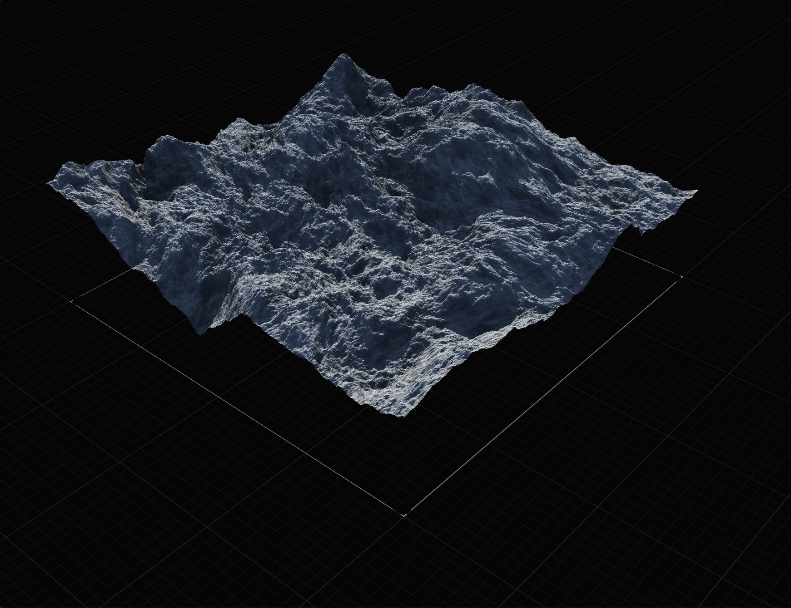
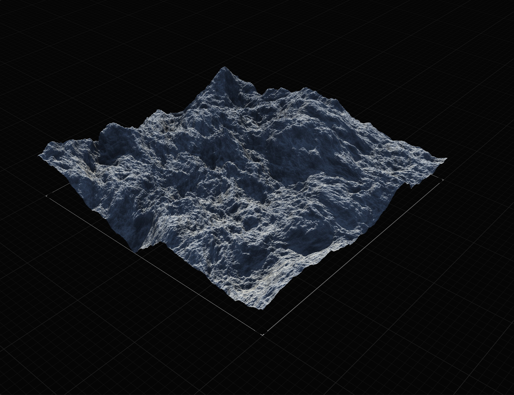
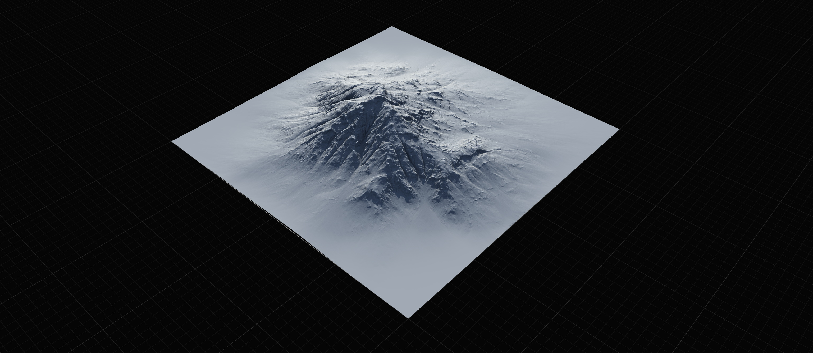
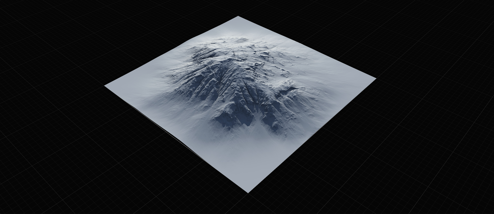
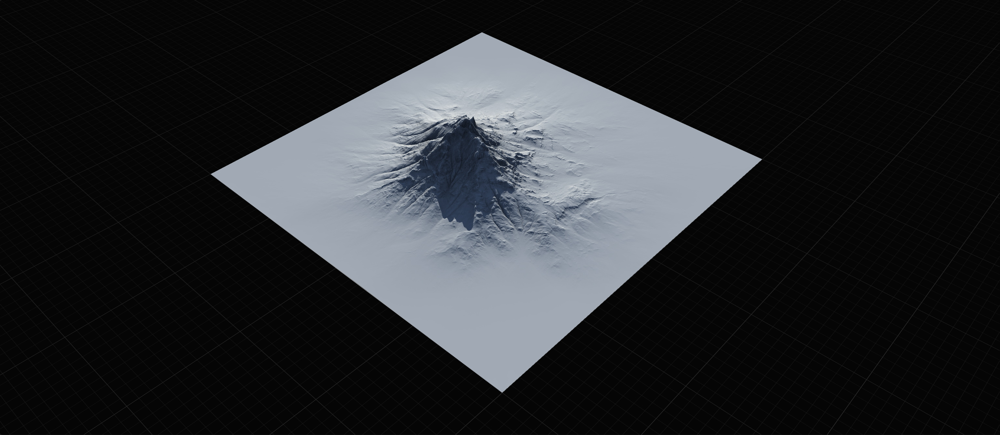
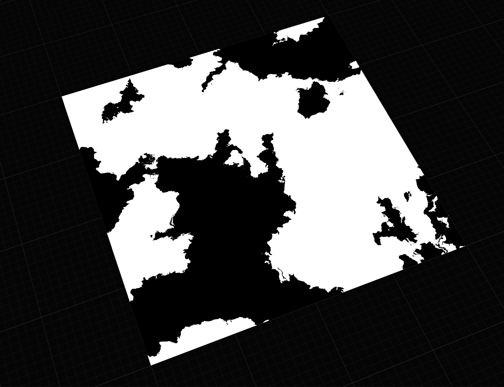

# Using Modifiers

<figure><figcaption></figcaption></figure>

## Modifiers

The Modifier Stack provides quick access to common adjustments, masks, and modifications that you may wish to apply to a node. Traditionally, node-based software would require you to create an additional node for each such adjustment - often resulting in complicated graphs that are difficult to manage.

For basic information about Modifiers, see [modifier-stack.md](../../getting-started/user-interface/property-editor/modifier-stack.md "mention")

### Fast and Less Overhead

Modifiers work as a post-process so updating them does not require re-building the node. And unlike nodes, Modifiers don't create excess overhead. The memory cost of 6 modifiers is the same as 1 modifier, however the cost of 6 nodes of the same types would create 6 times the overhead.

## Common Scenarios

### Adjusting the Height

If a terrain (or mask) is not the exact height values you need, you can use the Height Remap modifier to adjust both the lower and upper extent of your terrain. Bringing up the bottom "raises" the terrain from the bottom, while "lowering" the top makes the terrain shorter.

<figure><figcaption></figcaption></figure>

Inversely, bringing the top beyond 1.0 makes your terrain taller than the original range.

### Making Stronger Masks

By simply applying Autolevel, Equalize, or Shaper (positive value) you can take a weak mask and make it stronger.

<figure><figcaption></figcaption></figure> <figure><figcaption></figcaption></figure>

### Dropping the Terrain

The "Drop" modifier removes any "empty" space under the terrain, forcing it to drop to the "floor".

<figure><figcaption></figcaption></figure>

<figure><figcaption>
Normal Perlin
</figcaption></figure> <figure><figcaption>
Dropped Perlin
</figcaption></figure>

### Bulking Up or Bulking Down

Using Shaper, you can bulk up or bulk down a terrain. It can apply to masks as well. For example, taking Flow Map output and making it stronger by adding Shaper.

<figure><figcaption>
Original terrain
</figcaption></figure>

<figure><figcaption>
Shaper at +50
</figcaption></figure> <figure><figcaption>
Shaper at -50
</figcaption></figure>

### Restrict Effect to Slope or Height

You can easily restrict the effect of a node to a height or slope range by adding a "Mask by Height" or "Mask by Slope" modifier on the effect node.

<figure><figcaption></figcaption></figure>

<figure><figcaption></figcaption></figure>


You can attach a DataExtractor node to any node that uses a Mask by Height/Slope modifier, and get the exact mask generated as a separate output.


### Using Min and Max

The Min and Max modifiers are one of the most powerful tools in Gaea.

### Breaking up a Mask

Sometimes you want a bit of crunchy detail to breakup the edges of your mask or introduce some uneven variations. Add a Warp modifier with the appropriate Size and Strength to change the mask.

<figure><figcaption></figcaption></figure>

<figure><figcaption></figcaption></figure> <figure><figcaption></figcaption></figure>


Try mixing with Min or Max modifiers for broader options.


### Getting the Difference

