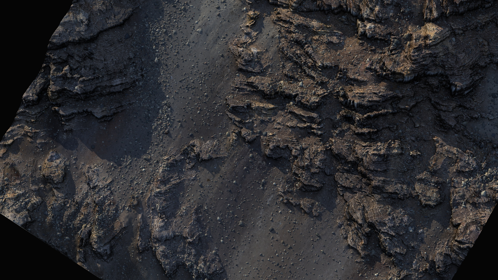

# Debris

<figure><figcaption></figcaption></figure>

Simulate mechanical erosion with thousands (even millions) of individual, physical rocks and other geological debris using our physics-engine powered Debris simulation.

<figure><figcaption></figcaption></figure>

<figure><figcaption></figcaption></figure>

You can keep them in the heightmap, or export a point-cloud for later use. You can even color each rock individually.

<figure><figcaption></figcaption></figure>

The Debris simulation lets you control the emission source so you can place the debris as needed. The friction setting allows you to choose how far the debris can fall.

<figure><figcaption></figcaption></figure>

You vary debris sizes and even layer multiple Debris simulations to mix and match settings and shapes. The Debris node provides Sharp and Round rock shapes.

See the Debris examples that ship with Gaea to see how layering multiple simulations work.

<figure><figcaption></figcaption></figure>


When using multiple Debris nodes, you can use [accumulators.md](../managing-graphs/accumulators.md "mention") to combine all the output masks for colorization and other purposes.


