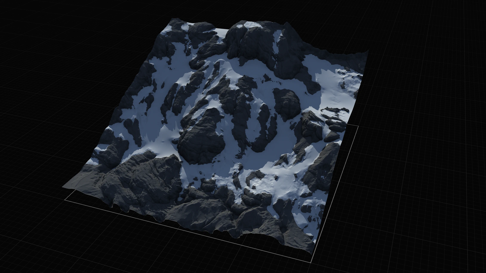
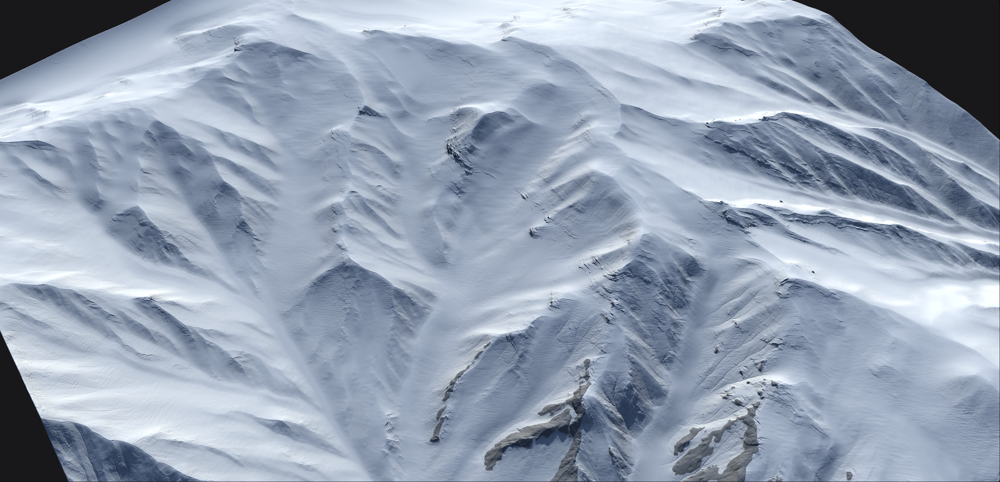
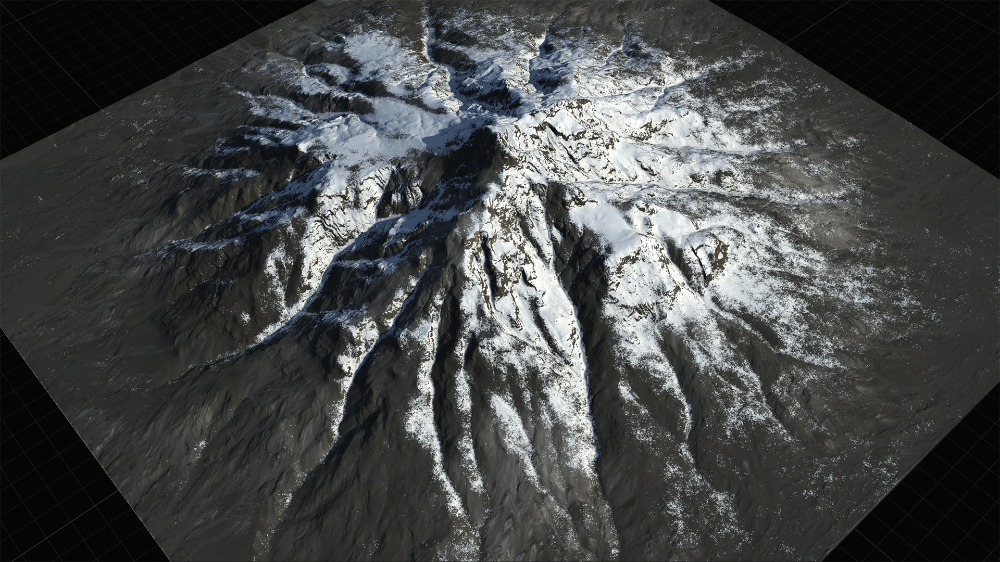

# Snowfall

<figure><figcaption></figcaption></figure>

## Snow

The Gaea Snow node is a powerful snowfall precipitation simulator. It uses advanced physics to simulate particles of snow with realistic clumping, adhesion, melt, thaw, and settling.

The simulation realistically simulates sequences of snowfall, melting, and settling that occur in real life.&#x20;

<figure><figcaption></figcaption></figure>

The Snow simulation's highlights are an intuitively controllable snowfall vs melt mechanism. Rather than simply reducing the amount of snowfall, you can mimic real life by keeping a higher level (or rather a longer duration, to be exact) of snowfall but also intersperse each snowfall cycle with a melt cycle. This creates more believable blankets of snow.

## Snowfield

Snowfield is a new snow node that creates heavy snowfall specifically for large environments and strong snowy peaks. It performs snow simulation in cascades, creating realistic interaction between new and old snow, as well as creating snow buildup that is not directly possible with a single Snow node.

<figure><figcaption></figcaption></figure>

## Dusting

Gaea 2.0 introduces a new lightweight snow node called Dusting which adds a thin layer of snow to your scene with a focus on creating light sprinklings of snow.

This node can be used with or without Snow.

<figure><figcaption></figcaption></figure>

## Glacier

The Glacier node takes Snow or other custom input and converts it into thick sheets of ice. The surface can be converted into a variety of surfaces, including directional sloped grooves, fluvial breakage, complex substructure, and more.

<figure><figcaption></figcaption></figure>

