# Vegetation

Geology influences vegetation growth. In Gaea, you can craft complex ecosystems for your terrains and drive them with relevant data such as conflicting zones, snow, water, and more.

<figure>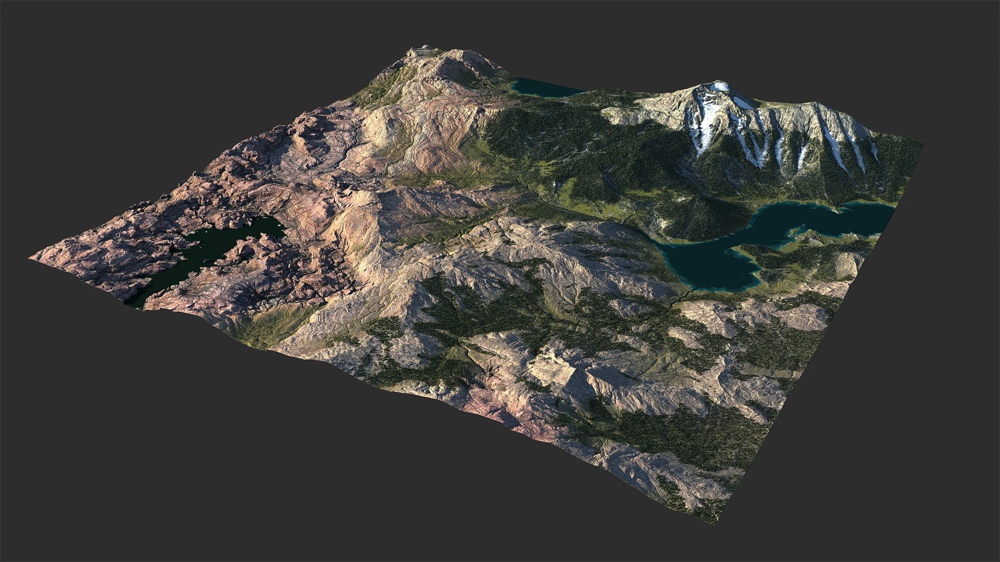<figcaption></figcaption></figure>

You can also set up biome-specific extras such as frozen lakes and drying rivers, and change growth patterns by directly linking them to biome drivers like snow melts and floodplains.

<figure>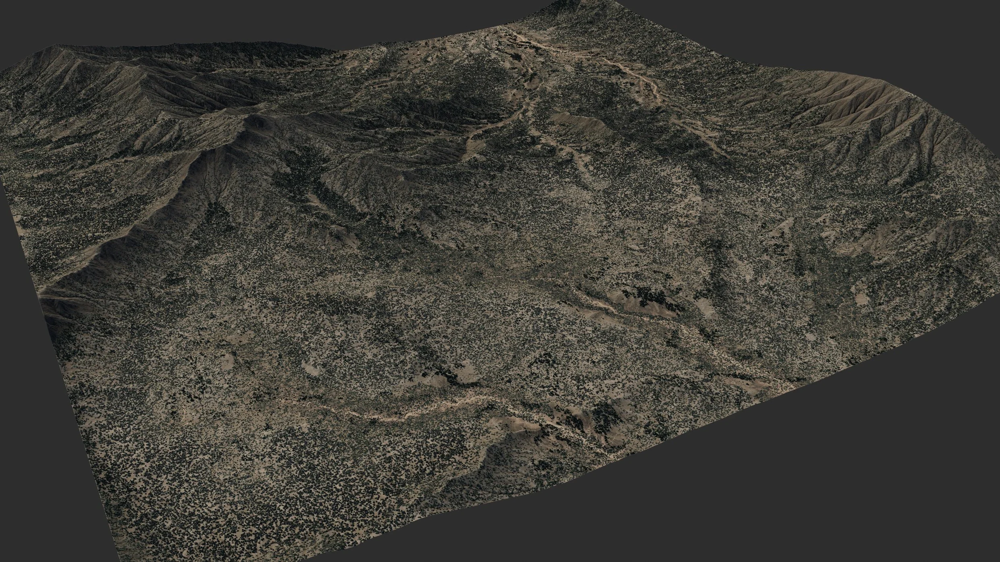<figcaption></figcaption></figure>

## Trees and Shrubs

The Trees and Shrubs nodes operate on basically the same principle but different sized plants, along with relevant deviations in how they create shapes.

Here you can see 3 separate populations or "ecotopes" created with 3 different Trees nodes. Each avoiding the other, but intermingling and creating scatter points within their own zones.

<figure>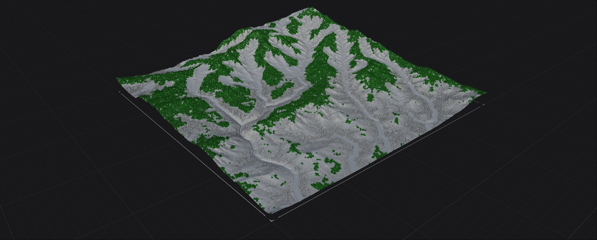<figcaption></figcaption></figure> <figure>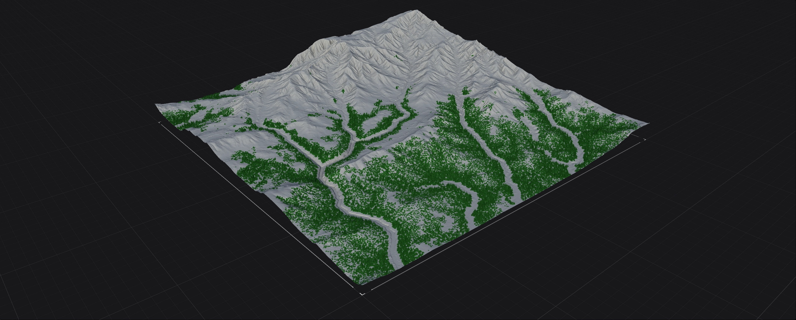<figcaption></figcaption></figure> <figure>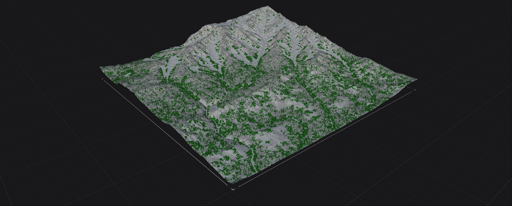<figcaption></figcaption></figure>

<figure>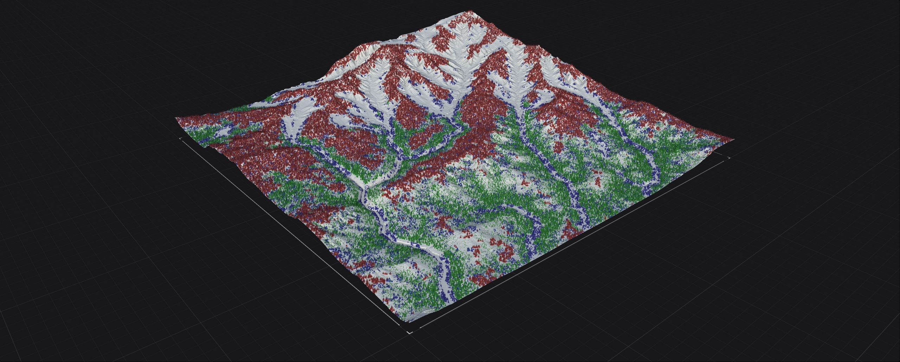<figcaption></figcaption></figure>

While you can often get great results from a single scatter/population, creating multiple populations with two or more Trees and/or Shrubs nodes gives you better control and a more realistic ecosystem.

## Procedural Ecosystems

Gaea's growth systems are powered by 3 major factors: growth or health, inhibitors, and dead zones.

### Growth / Health

First, you decide whether your growth should seek water or avoid it.

<figure>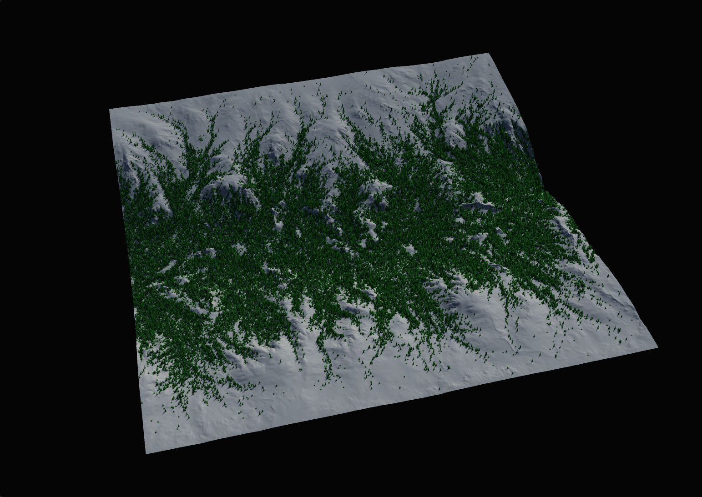<figcaption></figcaption></figure> <figure>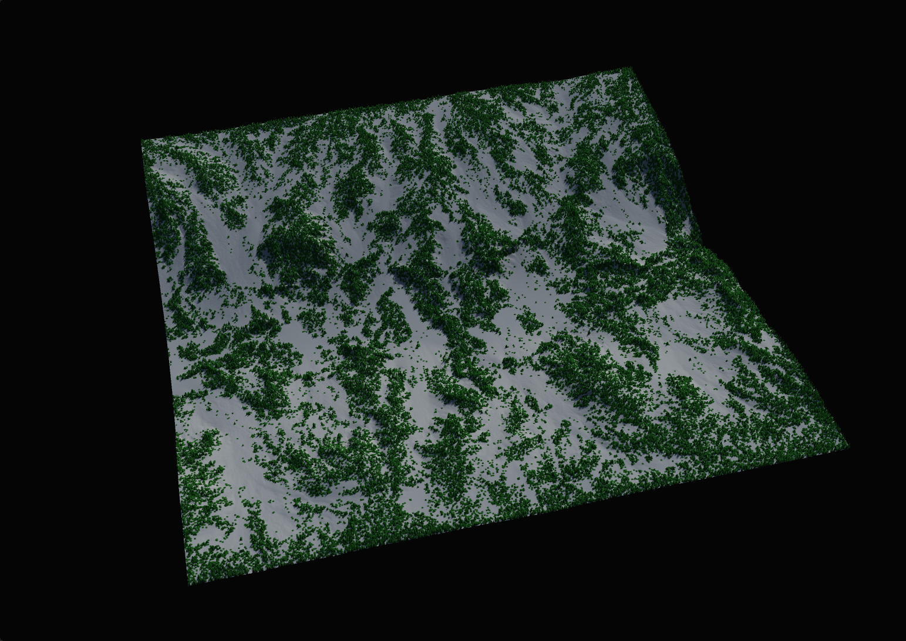<figcaption></figcaption></figure>

Health / Patches / Spread / Random help you control the patterns and extents of the population.

### Inhibitors

<figure>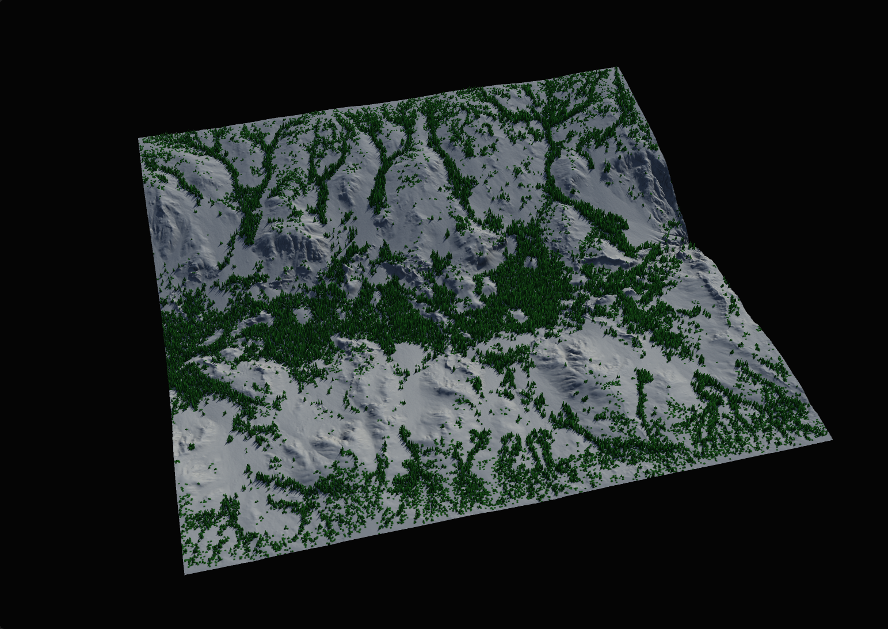<figcaption></figcaption></figure> <figure>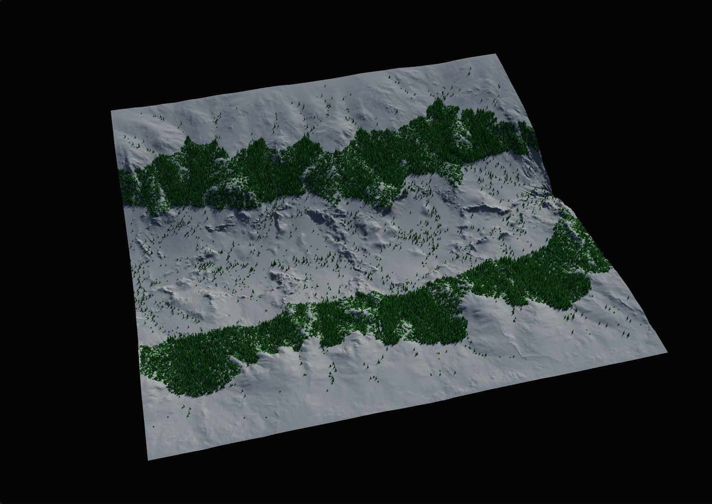<figcaption></figcaption></figure>

Slope and Height are the most essential inhibitors. You can choose which range of slope and height allows these trees to grow.

<figure>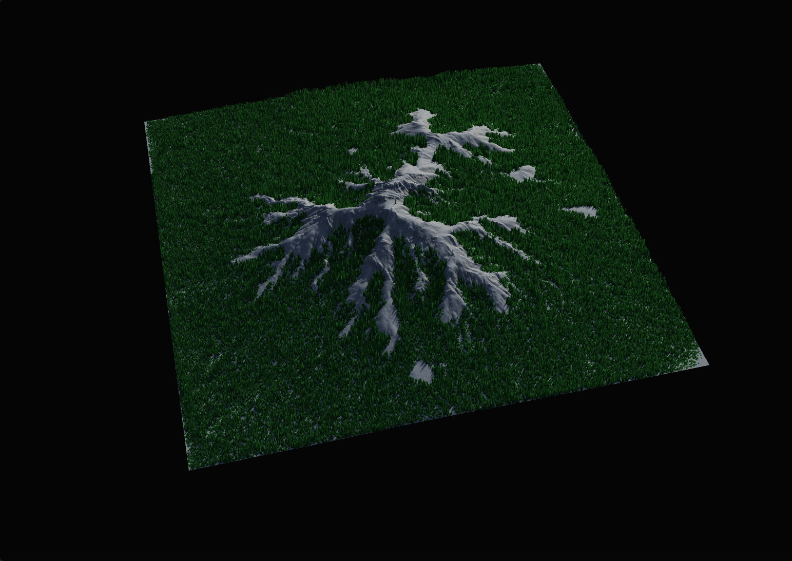<figcaption></figcaption></figure>

Peaks lets you avoid ridges and peaks without having to worry about Height or Slope.

### Dead Zones

When snow regularly falls and settles down slopes it creates an inhibition zone that prevents larger trees from growing.

<figure>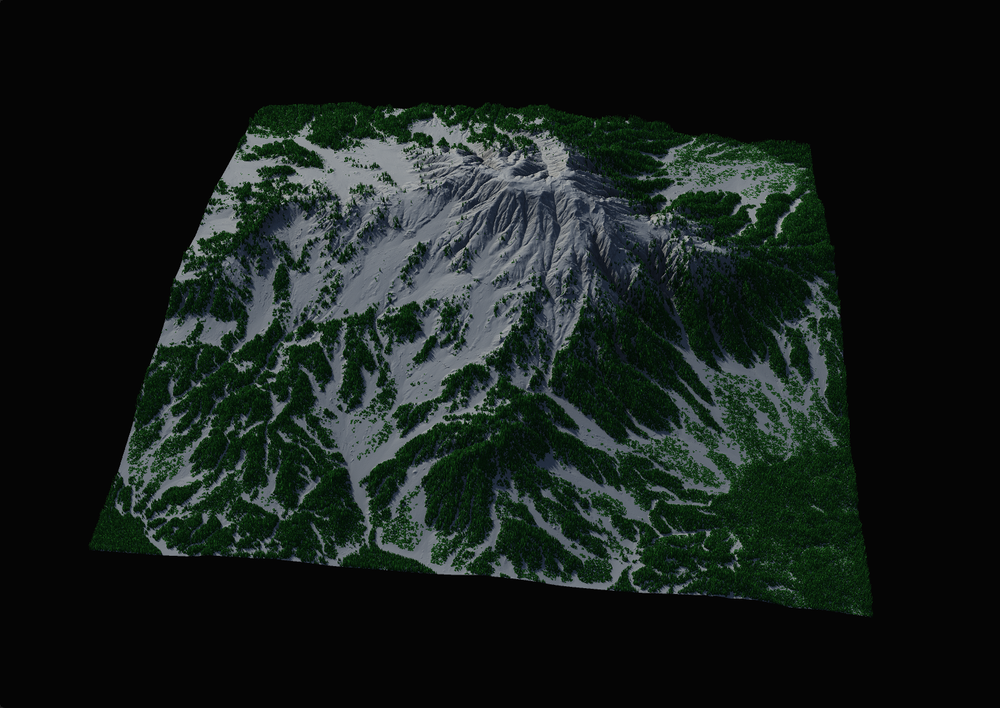<figcaption></figcaption></figure>

Dead Zones are slightly more complicated and often require a delicate touch. Dead Zones are optional.

<figure>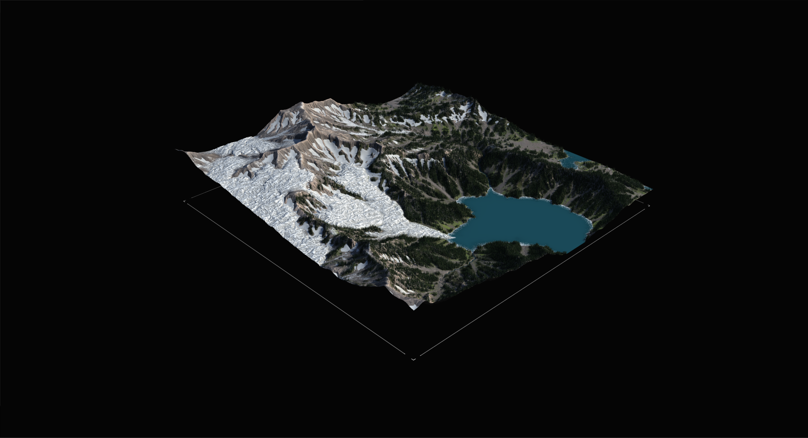<figcaption></figcaption></figure>

DeadZones are great opportunity to add talus, scree, other kinds of rocks and more.

## Visualizing Forces

The Visualize Data option let's you see the various factors affecting the ecosystem. This is a great way to debug your population and see the invisible forces.

Green are trees, blue are freshwater flows, and red are dead zones.

<figure>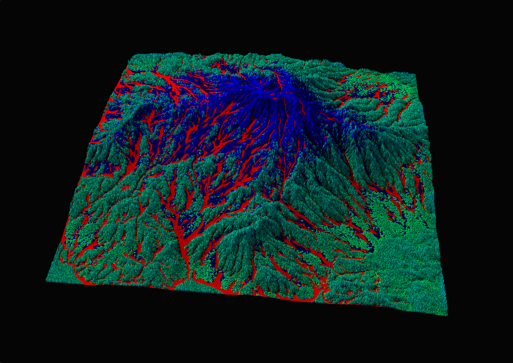<figcaption></figcaption></figure>

