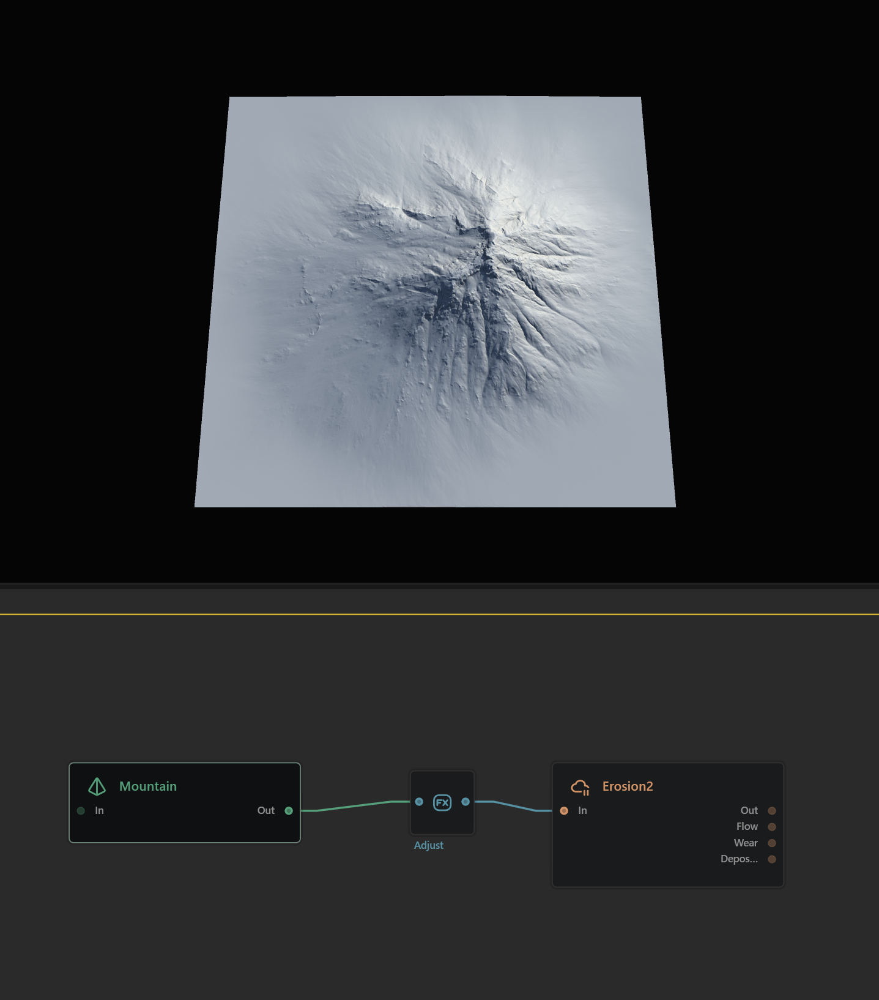
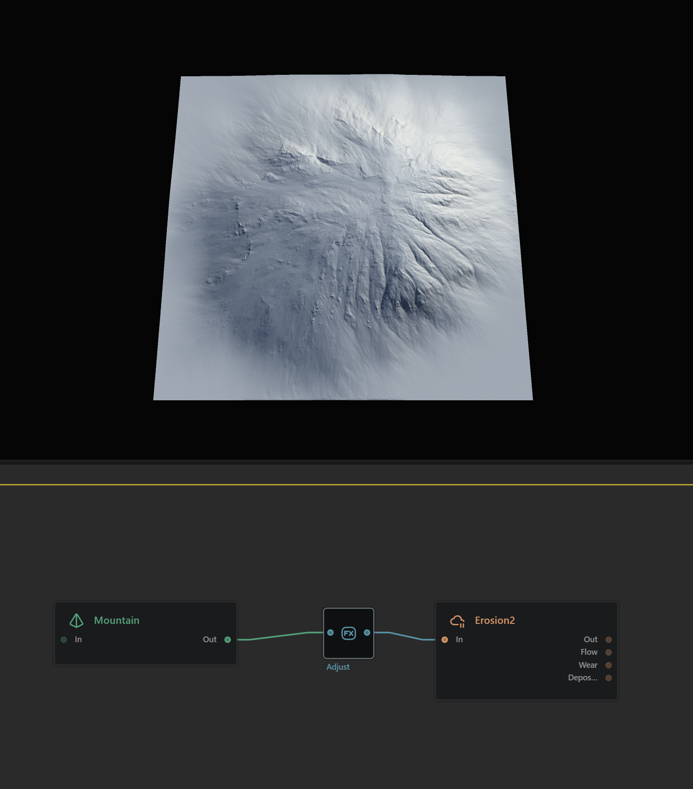
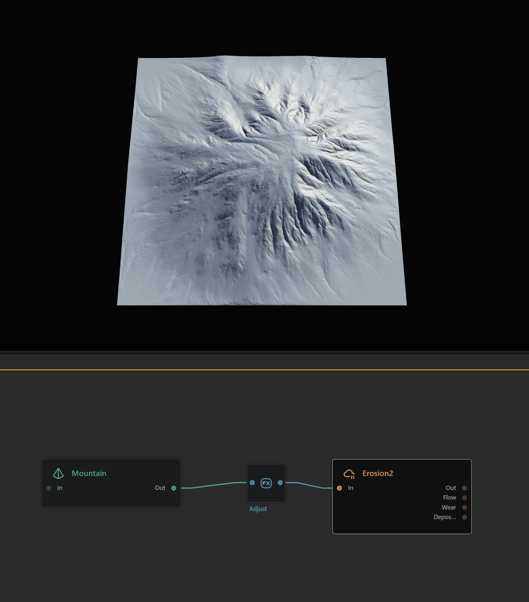

# Terrain Basics

Gaea uses nodes to create a graph that generates a terrain.

**Nodes** are building blocks for creating terrain features. Each node represents a specific function, like generating shapes, adding erosion, or applying textures.

**Graph** is where you connect these nodes in sequence to build complex terrains. Think of it as a flowchart that outlines each step in creating your landscape.

## Your First Terrain

This terrain graph is made of 3 building blocks, or Nodes. Each represents an object or action.

The first node creates a Mountain. It has a random shape, generated through mathematics.

<figure><figcaption>
Mountain Node
</figcaption></figure>

The second node is an Adjust node which, as the name suggests, adjusts the shape. In this case we use its Shaper property to bulk up the mountain and make it more expansive.

<figure><figcaption>
Adjust Node
</figcaption></figure>

The third and final node is an [erosion\_2](../understanding-erosion/erosion_2/ "mention") node. Erosion is one of the key processes in nature that forms a terrain's shape and character through slow modifications over eons. Gaea does this for you in a flash. This third node takes the basic mountain shape and applies a lot of erosion to make it more realistic - creating strong gullies on some sides and softer, mineral-deposited slopes on others.

<figure><figcaption>
Erosion2 Node
</figcaption></figure>

This is how most terrains work: You start with one shape or several, adjust them, and then process them with simulations like Erosion.
