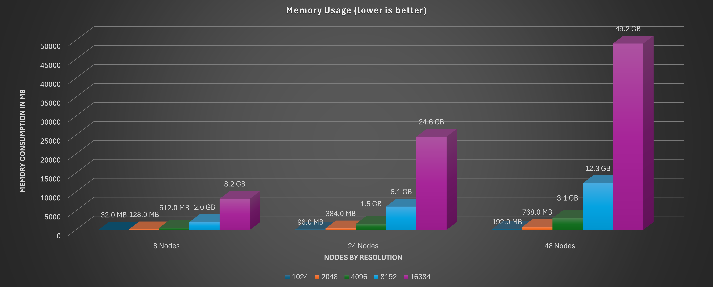

# Memory Requirements

Knowing how much memory Gaea will need for your project helps avoid performance issues and crashes. Here’s a simplified approach to understanding memory requirements in Gaea.

<figure><figcaption>
Your memory fills up by at least 4X as you double your resolution. This chart only shows final storage in RAM. It does not include the additional RAM required during processing to calculate each node.
</figcaption></figure>

**Understanding Memory Needs**

* **Memory Demand**: The more complex and detailed your terrain, the more memory it requires.
* **Factors Affecting Memory**: Resolution, node complexity, and layering all influence memory usage.

### **Resolution**

* **Impact of Resolution**: Higher resolutions consume more memory. A 2048x2048 resolution needs significantly less memory than an 8192x8192 resolution.
* **General Rule**: Doubling the resolution quadruples memory usage. For example, going from 1024x1024 to 2048x2048 will increase memory requirements fourfold.

### **Heightfields**

* **Heightfield**: The 3D representation of your terrain in Gaea.
* **Memory Calculation**:
  * Memory required = Resolution (width x height) x Bit Depth
  * Gaea uses 32-bit heightfields for high precision.
* **Example**: For a 1024x1024 resolution with 32-bit depth:
  * 1024 x 1024 x 4 bytes = \~4 MB

### **Layering Nodes**

* **Nodes**: Each node in Gaea represents an action or modification. More nodes mean more memory.
* **Layering**: Stacking multiple layers adds depth but also increases memory requirements.

### **System Memory and Performance**

* **Plan for Headroom**: Keep at least 25-30% of your system’s RAM free to ensure smooth performance.
* **Memory-Saving Tips**: Use lower resolutions and simpler nodes while experimenting. Gradually increase complexity as your project nears completion.

### **Exporting**

* **Export Size**: The larger the resolution at export, the more memory you’ll need during that process.
* **Preview Exports**: Try lower resolutions for test exports to verify results before the final high-resolution export.

***

## **Quick Tips for Beginners**

* **Start with Lower Resolutions**: Build your terrain in 1024x1024 and increase resolution as needed.
* **Simplify Your Node Graph**: Fewer nodes use less memory. Start with basic nodes and add detail as you go.
* **Keep Track of Available Memory**: Regularly check your system’s memory usage to prevent overloads.

***

With these tips, you’ll be better prepared to manage memory efficiently in Gaea and ensure smoother workflows and stable project builds.
