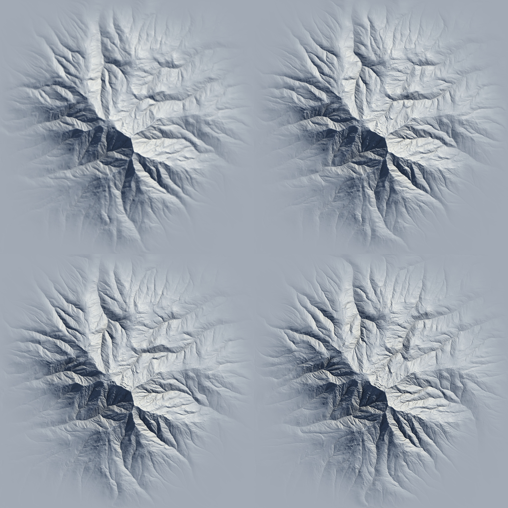

# Non-Determinism

In procedural terrain generation like in Gaea, non-deterministic output at different resolutions occurs because the way the algorithms process the terrain changes depending on the resolution. Here’s how it works:

1. **Grid Size**: Terrain is made up of a grid of points (pixels). At higher resolutions, the grid has more points, allowing for sharper details. At lower resolutions, there are fewer points, so details get simplified or smoothed out.
2. **Random Effects**: Randomized elements, like noise or rock shapes, look more detailed at high resolutions because there’s more space to show complexity. At lower resolutions, these effects are less detailed because the grid is smaller.
3. **Scaling**: When you increase or decrease the resolution, the terrain data is resized. This resizing process can slightly alter details, like slopes or edges, depending on how the data is adjusted.
4. **Algorithm Sensitivity**: Certain tools, like erosion, rely on the grid size for their calculations. Higher resolutions allow for finer details, while lower resolutions result in broader, less detailed changes.

Because of these factors, the terrain can look different at varying resolutions, even with the same settings.

<figure><figcaption>
Determinism across 512, 1024, 2048, and 4096 resolutions.
</figcaption></figure>

Gaea's algorithms are optimized to reduce the difference across resolutions as much as possible, especially with Erosion\_2, however depending on your terrain setup it may be unavoidable in some situations.

Some nodes like the classic Erosion provide a separate option to force Determinism by sacrificing processing speed.

### Forcing Determinism

One of the best ways to ensure a specific shape, especially at an early stage in your graph, is by [baking-nodes](../baking-nodes/ "mention") at a resolution you like. Gaea will then upscale them at whatever final resolution you use and further low-yield Erosion or other effects can help compensate for the upscaling artifacts.
