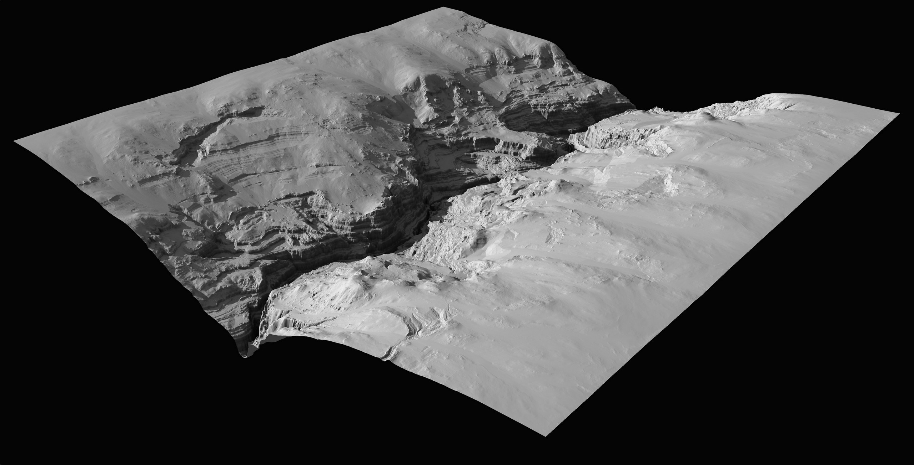

# Understanding Erosion

Erosion is a fundamental process in the natural world that plays a crucial role in shaping terrains. Gaea 2 takes inspiration from this natural phenomenon, meticulously mimicking the laws of nature to create realistic and dynamic landscapes. This powerful feature combines the rigor of scientific accuracy with the flexibility of artistic control, offering you an unparalleled tool for terrain creation.

<figure><figcaption></figcaption></figure>

By simply adding an erosion node and adjusting a control or two, you can achieve remarkable results with minimal effort. However, the true potential of Gaea 2’s erosion capabilities lies in the depth and nuance available within this versatile set of nodes. Whether you're looking for quick, beautiful results or seeking to fine-tune every aspect of your terrain's erosion, Gaea 2 provides the tools to make it happen.

## Erosion in Gaea

Erosion is the primary process through which we turn abstract and geometric shapes into believable terrains. It is one of the most crucial parts of any procedural terrain.

<figure><figcaption></figcaption></figure>

The Erosion node is the primary erosion node in Gaea. It provides sophisticated erosion with a very easy to use interface. The Erosion node provides control over the scale, where you can choose the size of the largest erosion feature and the overall scale of the terrain.

### **Resolution Independence**

The Erosion node's algorithm addresses one of the biggest problems in digital erosion: it preserves features across different resolutions. This means that a 512 x 512 preview build will maintain essential parity for all major erosion features with a high resolution 4K or 8K build. You no longer need to guess the output type.

The algorithms also create exquisite flows with naturalistic curves and controllable sediment deposits, never before been seen in digital erosion.

## The Power of Erosion

Gaea's Erosion is so powerful and intelligent that you can use extremely basic shapes to define the terrain and use Erosion to procedurally simulate all the details of a hydraulically eroded terrain.

Let's explore this with a simple example.

We start with a RadialGradient with absolutely no features. We apply Warp to add noise warping to the smooth shape to bring out some random detail. Then we apply 2 passes of Erosion\_2 and let it automatically carve out realistic details into the terrain.

<figure><figcaption>
A basic RadialGradient primitive.
</figcaption></figure>

<figure><figcaption>
Add Warp (either with a Warp node, or the Warp modifier) to the RadialGradient.
</figcaption></figure>

<figure><figcaption>
Erosion_2 pass 1 to create the larger gullies and fluvial structures.
</figcaption></figure>

<figure><figcaption>
Erosion_2 pass 2 to soften some of the ridges and compact the terrain further.
</figcaption></figure>

You can replace the RadialGradient with any other shape - whether an imported heightmap, hand-drawn ridge shape, or another primitive - and Erosion will convert it into a realistic landscape.

## Versatility

Gaea's Erosion can be adapted to a large variety of shapes and processes. You can do this by fine-tuning settings in Erosion\_2 or by using EasyErosion which provides preset processes through a simple interface.

<figure><figcaption></figcaption></figure> <figure><figcaption></figcaption></figure> <figure><figcaption></figcaption></figure>

<figure><figcaption></figcaption></figure> <figure><figcaption></figcaption></figure> <figure><figcaption></figcaption></figure>

## **Determinstic Output**

It is worth noting that, due to the nature of the algorithm and parallel processing, the erosion flow may differ slightly each time. To ensure 100% exact results every time, you can turn on the `Deterministic` option in the Erosion\_1 node. This will force Gaea to use a single processor core which will result in slower processing, but will ensure your results are completely predictable.

This may not always be necessary. There are also workarounds. For example, if you wish to control certain major flow lines, you can create a mask for the starting points of those flows and feed it to Selective Processing. This is usually done best in a second Erosion node, while the first provides general erosion across the terrain.

## Misconceptions 

There are a few misconceptions about erosion in procedural terrains that mainly stem from outdated ideas from previous generation software or inexperience with the medium.

### **Erosion should be the last step**

Previously, artists would use Erosion as the very last node in the construction of a terrain because Hydraulic erosion was the only process that could provide flow, deposit, and other data maps to be used for texture creation. This technique is based on technological limitations from over a decade ago. That former paradigm trained artists (incorrectly) and has led to limited creativity in digital terrains. Further, it is unsuitable to use the flow data from an Erosion node as the primary driving force in a texture. Real terrains rarely have clean flow lines - and those too are mostly in the form of rivers. Such textures make digital terrains extremely conspicuous.

With a cutting-edge software like Gaea, there are many options for generating data maps at any point in the graph. This removes the need for Erosion data for texturing purposes. You can use Texture to create the base for any procedural color map. Flow, Soil, RockMap, Occlusion, and other Data Maps can generate texture-friendly data without actually processing the terrain.

### **Erosion is mandatory**

Another old belief is that Erosion is required after any processing to ensure the terrain looks believable. While this may be true in some cases, if you are using LookDev nodes or other erosion processes, applying Hydraulic erosion may detract from the non-hydraulic-eroded look you desire because it creates soft soil deposits and erosive flows.

LookDev nodes such as Canyonizer, Stacks, Anastomosis, Shear, etc. can create effects that don't need to be reprocessed with Erosion to be believable.
