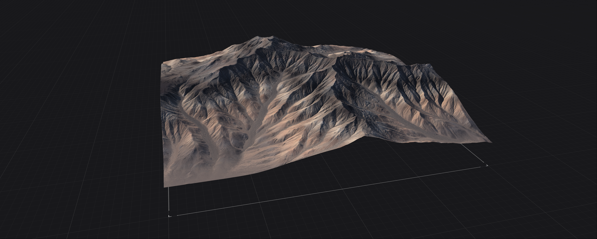

# Erosion\_2

The **Erosion\_2** node in Gaea 2 is a powerful new erosion algorithm designed to enhance terrain shaping capabilities beyond the traditional Classic Erosion.&#x20;

<figure><figcaption></figcaption></figure>

Despite its complexity, Erosion\_2 remains user-friendly and delivers deterministic results with up to 10x faster performance, even on the CPU.

<figure><figcaption></figcaption></figure>

## Using Erosion\_2

The **Erosion\_2** node offers extensive control over the erosion process, allowing users to shape terrain with a range of new options and refinements.&#x20;



<figure><figcaption></figcaption></figure>

### Primary Control

This group of controls are the primary driver of the Erosion simulation. Each setting here can have a strong effect on the erosion simulation and change things greatly.

<figure><figcaption></figcaption></figure>

#### Duration

The longer the **Duration**, the more elaborate the resulting terrain will be. However, it is not always necessary to use long lengths. When want to preserve your terrain shape, it is better to use multiple shorter duration Erosion2 nodes than one very high duration one. If you are crafting the terrain shape through Erosion, then a high duration is useful.

#### Downcutting

Downcutting controls how deep flowing water cuts into the terrain, while the **Erosion Scale** determines the largest gullies' size across the entire terrain. Both settings can easily cause an impact on the other, so use a bit of experimentation to see how it affects your specific terrain.

#### Erosion Scale

Small values in **Erosion Scale** can create very fine, sharp gullies and crevices while large values create large ravines and huge flow structures. You can use multiple Erosion2 nodes with different scales to create complex erosion. It is recommended that nodes with higher Erosion Scale should precede nodes with smaller scales so the subsequent erosion does not destroy the finer details.

### Sedimentary Control

Sedimentation in Gaea simulates the transport and deposition of debris generated during erosion—such as soil, pebbles, and rocks. This process is governed by three distinct sedimentation types: **Suspended Load**, **Bed Load**, and **Coarse Sediments**. These types represent increasing sediment mass and decreasing mobility.

<figure><figcaption></figcaption></figure>

Each type has its own **Discharge Angle**, which controls the slope angle at which sediment begins to settle. The lighter the sediment, the lower the angle it can travel on. Heavier sediments require steeper slopes to move or be deposited.


All three types contribute to the overall sedimentation equally. Setting all sliders to 1.0 will not triple the effect—instead, each type contributes about a third of the total sedimentation. They are also interlinked, often blending visually and physically.


#### **Suspended Load**

These are the finest and lightest sediments—typically silt and sand-like materials. They are extremely mobile and tend to stay suspended in flowing water, depositing only when the flow slows down (decelerates). Because of this, they are the most active component in terrain reshaping, especially within gullies.

While visually they may seem like rocks tumbling downslope, the simulation treats them as a dynamic agent tied closely to erosion. They flow across even gentle slopes (e.g., 0–24°) and often travel long distances before settling. Increasing Suspended Load results in subtle ripples and branching patterns within existing gullies, and with high **Duration** and **Downcutting**, can even generate entirely new gully systems.

#### **Bed Load**

These are heavier sediments—gravel and small rocks. They’re less mobile than suspended sediments but still quite active. Bed Load is less sensitive to acceleration/deceleration and more influenced by average water flow and terrain friction. It moves farther than coarse sediment, even across flat areas, but deposits more readily than suspended load.

Bed Load generates deposits like talus and can visually fill in or enhance slope structures. Use it carefully: high values can dominate the erosion outcome and overwhelm finer detail.

Bed Load Discharge is also useful in filling up gullies created by the erosion. It is a good compensation for having higher Downcutting.

#### **Coarse Sediments**

These represent the heaviest material—rocks, boulders, and debris. They are the least mobile and tend to settle rapidly, usually requiring steeper slopes to begin movement. A discharge angle of 24° for coarse sediments means they will be deposited only on or near such steep inclines; you will not see them on flat areas.

Coarse sediments produce the most dramatic deposits—such as scree, debris piles, and alluvial fans—and are ideal for shaping realistic sedimentation structures.


Sedimentation and Downcutting are deeply linked as Sedimentation can be a direct product of Downcutting. Experiment with your terrain to see how downcutting can become a force multiplier for your sedimentation.


Bed Load and Coarse Sediments also create wonderful shapes that is favorable for adding Scree, Debris simulations, or [ColorErosion](../../colorizing-and-textures/colorerosion.md).

### Shape Control

This group of controls are useful for artistic control over the simulation, from shaping the peaks to controlling the level of detail.

<figure><figcaption></figcaption></figure>

#### Shape

The Shape control allows you choose between retaining the original shape (low values) or allowing erosion to naturally reshape the peaks of the terrain (high values).&#x20;

This processing is low-level Thermal erosion wrapped within Hydraulic erosion simulation.

#### Shape Sharpness

In conjunction with Shape, the Shape Sharpness control lets you shape the terrain to have more concave, sharp ridges. This is a great way to get the right kind of look for your terrain.

The Shape Detail Scale control is very important when it comes to surface structure. This control lets you choose how much concentric smaller details are simulated - from the largest ravines to the finest gullies within them. This is a very useful tool for reducing unnecessary detail - especially for distant terrains or if you plan add further detail using [Surface nodes](../../crafting-the-surface/surface-nodes.md).

<figure><figcaption></figcaption></figure>

### Orographic Influence

Orographic influence allows you to limit where Erosion is inhibited.

<figure><figcaption></figcaption></figure>

#### Enable

Toggle all Orographic influences.

#### Directional Precipitation

This enables rain shadows, forcing precipitation to occur more intensely on one side.

#### Direction

The direction from which rainfall occurs more strongly. This may not completely stop rainfall in other directions, but reduces its intensity.

#### Rain Shadow

Directional rain can be influenced by other nearby peaks and structures. Rain coming from a specific direction may be blocked by the rain shadow. This control allows you to choose the strength of the rain shadow.

#### Altitude and Slope

These controls allow you to choose the range for both Height and Slope within which rainfall occurs. This can be used to create both realistic and highly artistic results.

#### Reverse

Inverses the influence.

## Faster Performance

Gaea's Erosion\_2 can utilize either GPU or CPU. It has an intelligent fallback if your GPU runs out of VRAM then it will run the erosion on the CPU where it may be slightly slower but less likely to run of of memory.

In every scenario, Erosion\_2 can outrun classic Erosion by several magnitudes.

<figure><figcaption></figcaption></figure>

<figure><figcaption></figcaption></figure>
