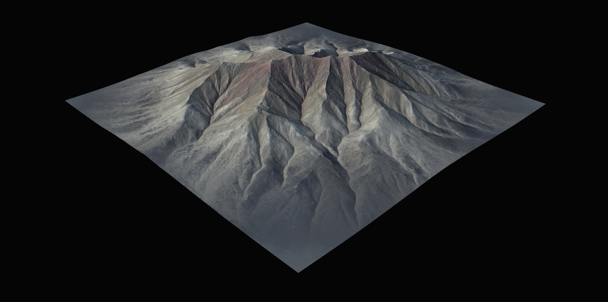

# Erosion\_2 in Action

Erosion\_2 was meant to be incredibly flexible from the beginning. While compared to Erosion\_1 it may look like it has fewer controls and therefore less complexity, you can get an amazingly vast range of results from those few settings.

Downcutting, Erosion Scale, and the Shape controls play a large range and their combinations can produce very different results - especially when you increase the Duration.

Below is a set of 24 different looks achieved from the same terrain by simply applying Erosion\_2 in different ways.

<table data-full-width="true"><thead><tr><th width="705.7999267578125">Preview</th><th valign="top">Settings</th></tr></thead><tbody><tr><td>

<figure><figcaption></figcaption></figure>
</td><td valign="top">Default Settings</td></tr><tr><td>

<figure><figcaption></figcaption></figure>
</td><td valign="top">Duration: <code>117.4</code> Downcutting: <code>0.059</code> ErosionScale: <code>16.7</code> SuspendedLoadDischargeAmount: <code>0</code> BedLoadDischargeAmount: <code>0.2</code></td></tr><tr><td>

<figure><figcaption></figcaption></figure>
</td><td valign="top">Duration: <code>117.4</code> Downcutting: <code>0.059</code> ErosionScale: <code>87.2</code> SuspendedLoadDischargeAmount: <code>0</code> BedLoadDischargeAmount: <code>0.2</code> CoarseSedimentsDischargeAmount: <code>1</code></td></tr><tr><td>

<figure><figcaption></figcaption></figure>
</td><td valign="top">Duration: <code>117.4</code> Downcutting: <code>0.059</code> ErosionScale: <code>517.3</code> BedLoadDischargeAmount: <code>0.20</code> CoarseSedimentsDischargeAmount: <code>1</code></td></tr><tr><td>

<figure><figcaption></figcaption></figure>
</td><td valign="top">Duration: <code>117.4</code> Downcutting: <code>0.243</code> ErosionScale: <code>517.3</code> BedLoadDischargeAmount: <code>0.207</code> CoarseSedimentsDischargeAmount: <code>1</code></td></tr><tr><td>

<figure><figcaption></figcaption></figure>
</td><td valign="top">Duration: <code>117.4</code> Downcutting: <code>0</code> ErosionScale: <code>20000</code> BedLoadDischargeAmount: <code>0.207</code> CoarseSedimentsDischargeAmount: <code>1</code></td></tr><tr><td>

<figure><figcaption></figcaption></figure>
</td><td valign="top">Duration: <code>117.4</code> Downcutting: <code>0.353</code> ErosionScale: <code>20000</code> SuspendedLoadDischargeAngle: <code>36.3</code> BedLoadDischargeAmount: <code>0.587</code> BedLoadDischargeAngle: <code>34.0</code> CoarseSedimentsDischargeAmount: <code>1</code> CoarseSedimentsDischargeAngle: <code>31.4</code> Shape: <code>0</code> ShapeDetailScale: <code>1</code></td></tr><tr><td>

<figure><figcaption></figcaption></figure>
</td><td valign="top">Duration: <code>117.4</code> Downcutting: <code>0.353</code> ErosionScale: <code>20000</code> SuspendedLoadDischargeAngle: <code>36.3</code> BedLoadDischargeAmount: <code>0.587</code> BedLoadDischargeAngle: <code>34.0</code> CoarseSedimentsDischargeAmount: <code>1</code> CoarseSedimentsDischargeAngle: <code>31.4</code> Shape: <code>0.085</code> ShapeSharpness: <code>0</code> ShapeDetailScale: <code>0.053</code></td></tr><tr><td>

<figure><figcaption></figcaption></figure>
</td><td valign="top">Duration: <code>117.4</code> Downcutting: <code>0.353</code> ErosionScale: <code>20000</code> SuspendedLoadDischargeAngle: <code>36.3</code> BedLoadDischargeAmount: <code>0.199</code> BedLoadDischargeAngle: <code>34.0</code> CoarseSedimentsDischargeAmount: <code>0.067</code> CoarseSedimentsDischargeAngle: <code>31.4</code> Shape: <code>0.085</code> ShapeSharpness: <code>0</code> ShapeDetailScale: <code>0.053</code></td></tr><tr><td>

<figure><figcaption></figcaption></figure>
</td><td valign="top">Duration: <code>196.7</code> Downcutting: <code>0.253</code> ErosionScale: <code>20000</code> SuspendedLoadDischargeAngle: <code>36.3</code> BedLoadDischargeAmount: <code>0.441</code> BedLoadDischargeAngle: <code>7.9</code> CoarseSedimentsDischargeAmount: <code>0.391</code> CoarseSedimentsDischargeAngle: <code>24.0</code> Shape: <code>0.079</code> ShapeSharpness: <code>0.199</code> ShapeDetailScale: <code>1</code></td></tr><tr><td>

<figure><figcaption></figcaption></figure>
</td><td valign="top">Duration: <code>106.5</code></td></tr><tr><td>

<figure><figcaption></figcaption></figure>
</td><td valign="top">Duration: <code>106.5</code> Downcutting: <code>0.183</code> ErosionScale: <code>20000</code> ShapeDetailScale: <code>0.019</code></td></tr><tr><td>

<figure><figcaption></figcaption></figure>
</td><td valign="top">Duration: <code>106.5</code> Downcutting: <code>0.183</code> ErosionScale: <code>20000</code> BedLoadDischargeAmount: <code>0.095</code> BedLoadDischargeAngle: <code>34.069</code> Shape: <code>0.367</code> ShapeSharpness: <code>0.261</code> ShapeDetailScale: <code>1</code></td></tr><tr><td>

<figure><figcaption></figcaption></figure>
</td><td valign="top">Duration: <code>90.4</code> Downcutting: <code>0.111</code> ErosionScale: <code>653.6</code> BedLoadDischargeAmount: <code>0.113</code> CoarseSedimentsDischargeAmount: <code>1</code> ShapeDetailScale: <code>0.039</code></td></tr><tr><td>

<figure><figcaption></figcaption></figure>
</td><td valign="top">Duration: <code>64.5</code> Downcutting: <code>0.5253405</code> ErosionScale: <code>124.0</code> BedLoadDischargeAmount: <code>1</code> CoarseSedimentsDischargeAmount: <code>1</code> Shape: <code>0.633</code> ShapeSharpness: <code>0.089</code> ShapeDetailScale: <code>0.016</code></td></tr><tr><td>

<figure><figcaption></figcaption></figure>
</td><td valign="top">Shape: <code>1</code> ShapeSharpness: <code>1</code></td></tr><tr><td>

<figure><figcaption></figcaption></figure>
</td><td valign="top">Downcutting: <code>0.711</code> ErosionScale: <code>3713.4</code> SuspendedLoadDischargeAmount: <code>0</code> Shape: <code>1</code> ShapeSharpness: <code>0.711</code> ShapeDetailScale: <code>0</code></td></tr><tr><td>

<figure><figcaption></figcaption></figure>
</td><td valign="top">Downcutting: <code>0.683</code> ErosionScale: <code>201.8</code> BedLoadDischargeAmount: <code>1</code> BedLoadDischargeAngle: <code>21.5</code> CoarseSedimentsDischargeAmount: <code>0.139</code></td></tr><tr><td>

<figure><figcaption></figcaption></figure>
</td><td valign="top">Duration: <code>164.9</code></td></tr><tr><td>

<figure><figcaption></figcaption></figure>
</td><td valign="top">Duration: <code>57.8</code> BedLoadDischargeAmount: <code>1</code> ShapeDetailScale: <code>1</code></td></tr><tr><td>
<figure><figcaption></figcaption></figure>
</td><td valign="top">Duration: <code>90.4</code> Downcutting: <code>0.045</code> ErosionScale: <code>195.8</code></td></tr><tr><td>
<figure><figcaption></figcaption></figure>
</td><td valign="top">Duration: <code>67.2</code> ErosionScale: <code>204.8</code> SuspendedLoadDischargeAmount: <code>0.171</code> BedLoadDischargeAmount: <code>1</code> BedLoadDischargeAngle: <code>24.8</code> CoarseSedimentsDischargeAmount: <code>1</code> CoarseSedimentsDischargeAngle: <code>15.8</code></td></tr><tr><td>
<figure><figcaption></figcaption></figure>
</td><td valign="top">Downcutting: <code>0.073</code> ErosionScale: <code>8350.7</code> SuspendedLoadDischargeAmount: <code>0</code> Shape: <code>0.635</code></td></tr><tr><td>
<figure><figcaption></figcaption></figure>
</td><td valign="top">Duration: <code>134.5</code> SuspendedLoadDischargeAmount: <code>0</code> BedLoadDischargeAmount: <code>0.039</code> BedLoadDischargeAngle: <code>37.6</code> Shape: <code>0</code></td></tr></tbody></table>
